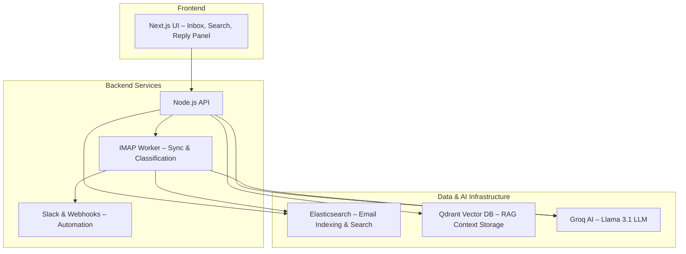

# OneBox: Real-Time AI Email Aggregator

OneBox is a high-performance email aggregation, indexing, and automation system built for modern inbox workflows.  
It features real-time synchronization, Elasticsearch search, Groq-powered AI categorization, and a Retrieval-Augmented Generation (RAG) system for suggested replies.

---

## Key Technologies

**Backend/API:** Node.js, TypeScript, Express  
**Frontend:** Next.js 15  
**Database/Search:** Elasticsearch, Qdrant Vector DB  
**AI/LLM:** Groq (Llama 3.1)  
**Sync:** IMAP IDLE Protocol  

---

# Core Features

## 1. Real-Time Synchronization & Storage
- **Zero Polling:** Uses IMAP IDLE for immediate email detection.  
- **Initial Sync:** Fetches the last 30 days of emails on startup.  
- **Storage:** All emails indexed into Elasticsearch for speed and querying.  
- **Supports Multiple Accounts** (only Account 1 enabled by default).

---

## 2. Advanced Search & Filtering
- **Full-Text Search:** Across subject, body, sender, and recipient fields.  
- **Filters:** Folder, account, AI category.  
- Optimized for fast retrieval on large inboxes.

---

## 3. Hybrid AI Categorization

A dual-pipeline system ensures accuracy while avoiding model rate limits:

| Condition                 | Model Used              | Benefit                          |
|---------------------------|--------------------------|----------------------------------|
| Recent Emails (< 24 hrs) | Groq Llama 3.1           | High accuracy, contextual        |
| Older Emails             | Local Keyword Classifier | Zero rate-limit risk             |

**Supported Categories:**  
Interested, Meeting Booked, Not Interested, Spam, Out of Office

---

## 4. RAG-Based Suggested Replies (Final Requirement)

This subsystem generates context-aware reply drafts.

### Flow:
- **Context Retrieval:** Email content is embedded and matched against Qdrant Vector DB.  
- **LLM Generation:** Context + email passed to Llama 3.1.  
- **Frontend:** UI supports generate, regenerate, and copy-to-clipboard actions.

---

## 5. Workflow Automation

Triggered for all emails categorized as **Interested**:
- **Slack Notification:** Sent to a configured channel.  
- **Webhook Trigger:** Hits a configurable endpoint (webhook.site recommended).

---

# Technical Architecture




---

# API Endpoints

| Method | Endpoint                | Description                          |
|--------|--------------------------|--------------------------------------|
| GET    | `/api/emails`            | Fetch all emails (supports filters)  |
| GET    | `/api/emails/search?q=`  | Full-text search (Elasticsearch)     |
| POST   | `/api/reply`             | Generate RAG-based suggested reply   |
| GET    | `/api/health`            | Backend health check                 |

---

# Local Setup Guide

## 1. Clone & Navigate

```bash
git clone https://github.com/PranavAK3704/OneBox
cd OneBox
```

---

## 2. Start Docker Services

This runs Elasticsearch, Qdrant, and Kibana.

```bash
cd docker
docker-compose up -d
```

Verify:

```bash
docker ps
```

You should see:
- elasticsearch  
- qdrant  
- kibana  

---

## 3. Configure Backend Environment

Create:

```
backend/.env
```

Paste:

```dotenv
# Backend Server
PORT=3000

# IMAP Account 1
IMAP_ACCOUNT1_HOST=imap.gmail.com
IMAP_ACCOUNT1_PORT=993
IMAP_ACCOUNT1_SECURE=true
IMAP_ACCOUNT1_USER=your-email@gmail.com
IMAP_ACCOUNT1_PASS=your-app-password  # Must be App Password

# AI / Automation
GROQ_API_KEY=your_groq_api_key
SLACK_WEBHOOK_URL=https://hooks.slack.com/services/...
WEBHOOK_URL=https://webhook.site/your-id

# Databases
ELASTICSEARCH_URL=http://localhost:9200
QDRANT_URL=http://localhost:6333
```

**Important:** Gmail requires an **App Password**, not your login password.

---

## 4. Install & Start Backend

```bash
cd ../backend
npm install
npm run dev
```

Backend will start at:

```
http://localhost:3000
```

This tab must remain open since it runs the IMAP worker.

---

## 5. Install & Start Frontend

Open a new terminal:

```bash
cd ../frontend
npm install
npm run dev
```

Frontend runs at:

```
http://localhost:3001
```

---

# Project Structure

```
OneBox/
├── backend/
│   ├── src/
│   │   ├── imap-worker.ts        # IMAP realtime sync + categorization
│   │   ├── ai-classifier.ts      # Groq + keyword classification
│   │   ├── rag-service.ts        # Qdrant + RAG reply generator
│   │   ├── es-utils.ts           # Elasticsearch integration
│   │   ├── notifier.ts           # Slack + webhook triggers
│   │   ├── routes.ts             # API endpoints
│   │   └── server.ts             # Express app
│   └── .env
├── frontend/
│   ├── app/                      # Next.js pages
│   └── components/               # EmailList, SuggestedReply, etc.
└── docker/
    └── docker-compose.yml
```

---

# Demo Video

```
https://www.loom.com/share/cd47d55a424b4ff3a7c2963694f13676
```

---

# Final Notes

This project implements all six assignment features:

- Real-time IMAP IDLE sync  
- Elasticsearch indexing and search  
- AI email categorization with fallback  
- Slack + webhook automation  
- Next.js inbox dashboard  
- Full RAG suggested reply system  

Optimized for speed, stability, and scalability.

